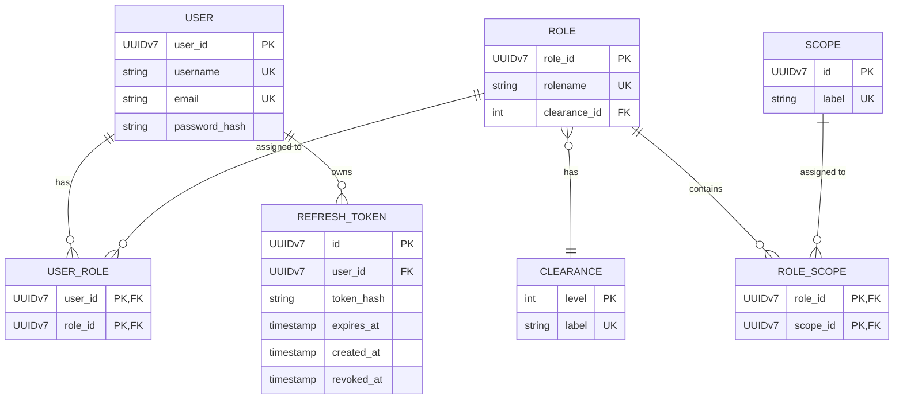

# Entwurfsdokumentation der Datenbank für den capitly.auth Service

Das capily.auth Modul erhält zur Verwaltung der Benutzer, deren Rollen und Rechte eine Datenbank. Diese Datenbank soll hier einen Erstentwurf erhalten.
Dafür werden Entitäten definiert und deren Beziehungen dargestellt. Ziel ist die Definition einer ersten, erweiterbaren Auth-Datenbank, die mit Flyway umgesetzt werden kann.

Die Vorarbeit zur Rollendefinition, bzw. Clearance und Scopes ist in [roles.md](./roles.md) zu finden.

## Entitäten und Beziehungen

| Entität | Fachliche Beschreibung | Attribute (Entwurf) | Beziehungen | Hinweise |
|---------|------------------------|---------------------|--------------|----------|
| **User** | Bestimmt einen Benutzer der Anwendung. Muss einen Benutzer eindeutig identifizierbar machen. | userId, username, email, passwort_hash | Muss eine Beziehung zu Rolle haben. | |
| **Role** | Verwaltungskombination aus Clearance und Scopes, weißt einem `USER` seine Rechte zu. | rolename | Muss eine Beziehung zu Clearance und Scope haben. | Clearance ist 1:n Ding, kann da mit rein |
| **Clearance** | Clearance‑Level sind organisatorische Sicherheitsstufen, die ergänzend zu den feingranularen Scopes gelten. Sie schützen sensible, systemweite oder administrative Aktionen (z. B. Konfigurationsendpoints, Benutzermanagement) und werden nach Scope‑Checks zur finalen Zugriffsentscheidung sowie für Audit‑ und Freigabeprozesse herangezogen. | level, label | Wird von `Role` genutzt. | |
| **Scope** | `Scopes` beschreiben Tätigkeiten oder Tätigkeitsbereiche als Recht. Sie führen zusammen mit `Clearance` zur Bildung von Rollen. | id, label | Wird von `Role` genutzt. | |
| **RefreshToken** | Repräsentiert ein langlebiges Token, mit dem ein neuer kurzlebiger JWT-Access-Token ausgestellt werden kann. | id, user_id, token_hash, expires_at, created_at, revoked_at | Gehört zu genau einem `User`. | Refresh Tokens werden nur gehasht gespeichert und können widerrufen werden. Rotation sollte unterstützt werden. |

## ER-Diagramm

