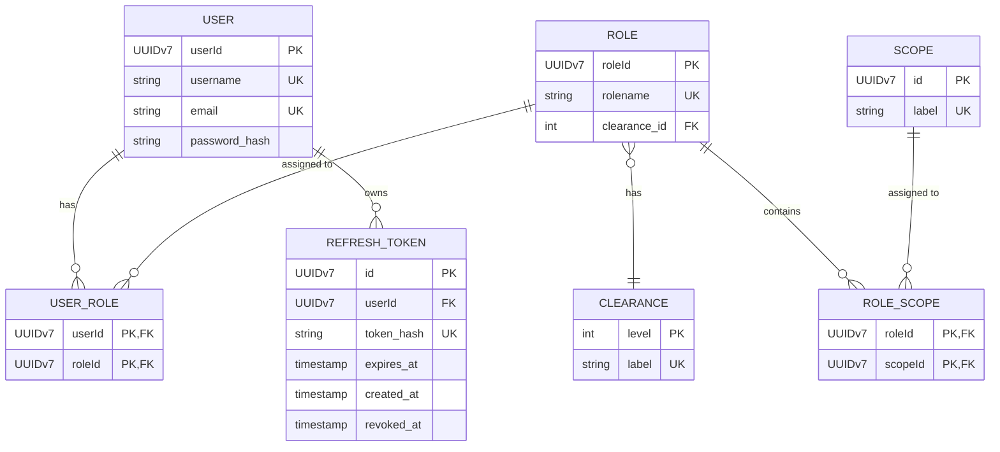

# Entwurfsdokumentation der Datenbank für den capitly.auth Service

Das capily.auth Modul erhält zur Verwaltung der Benutzer, deren Rollen und Rechte eine Datenbank. Diese Datenbank soll hier einen Erstentwurf erhalten.
Dafür werden Entitäten definiert und deren Beziehungen dargestellt. Ziel ist die Definition einer ersten, erweiterbaren Auth-Datenbank, die mit Flyway umgesetzt werden kann.

Die Vorarbeit zur Rollendefinition, bzw. Clearance und Scopes ist in [roles.md](./roles.md) zu finden.

## Entitäten und Beziehungen

| Entität | Fachliche Beschreibung | Attribute (Entwurf) | Beziehungen | Hinweise |
|---------|------------------------|---------------------|--------------|----------|
| **User** | Bestimmt einen Benutzer der Anwendung. Muss einen Benutzer eindeutig identifizierbar machen. | userId, username, email, passwort_hash | Muss eine Beziehung zu Rolle haben. | |
| **Role** | Verwaltungskombination aus Clearance und Scopes, weißt einem `USER` seine Rechte zu. | rolename | Muss eine Beziehung zu Clearance und Scope haben. | Clearance ist 1:n Ding, kann da mit rein |
| **Clearance** | Clearance‑Level sind organisatorische Sicherheitsstufen, die ergänzend zu den feingranularen Scopes gelten. Sie schützen sensible, systemweite oder administrative Aktionen (z. B. Konfigurationsendpoints, Benutzermanagement) und werden nach Scope‑Checks zur finalen Zugriffsentscheidung sowie für Audit‑ und Freigabeprozesse herangezogen. | level, label | Wird von `Role` genutzt. | |
| **Scope** | `Scopes` beschreiben Tätigkeiten oder Tätigkeitsbereiche als Recht. Sie führen zusammen mit `Clearance` zur Bildung von Rollen. | id, label | Wird von `Role` genutzt. | |
| **RefreshToken** | Repräsentiert ein langlebiges Token, mit dem ein neuer kurzlebiger JWT-Access-Token ausgestellt werden kann. | id, userId, token_hash, expires_at, created_at, revoked_at | Gehört zu genau einem `User`. | Refresh Tokens werden nur gehasht gespeichert und können widerrufen werden. Rotation sollte unterstützt werden. |

## ER-Diagramm

```mermaid
erDiagram
    USER {
        UUIDv7 userId PK
        string username UK
        string email UK
        string password_hash
    }

    ROLE {
        UUIDv7 roleId PK
        string rolename UK
        int clearance_id FK
    }

    CLEARANCE {
        int level PK
        string label UK
    }

    SCOPE {
        UUIDv7 id PK
        string label UK
    }

    USER_ROLE {
        UUIDv7 userId PK, FK
        UUIDv7 roleId PK, FK
    }

    ROLE_SCOPE {
        UUIDv7 roleId PK, FK
        UUIDv7 scopeId PK, FK
    }

    REFRESH_TOKEN {
        UUIDv7 id PK
        UUIDv7 userId FK
        string token_hash UK
        timestamp expires_at
        timestamp created_at
        timestamp revoked_at
    }

    USER ||--o{ USER_ROLE : "has"
    ROLE ||--o{ USER_ROLE : "assigned to"
    ROLE }o--|| CLEARANCE : "has"
    ROLE ||--o{ ROLE_SCOPE : "contains"
    SCOPE ||--o{ ROLE_SCOPE : "assigned to"
    USER ||--o{ REFRESH_TOKEN : "owns"
```

## Indizes

Identifikation von Spalten, die aufgrund häufiger Abfragen, Joins oder Filteroperationen schnell auffindbar sein müssen.

Dokumentation für den 1. Sprint.

> Alle Indexe sind bereist durch die Contraints automatisch gesetzt. [LINK](https://www.postgresql.org/docs/18/sql-createtable.html)

| Tabelle       | Feld          | Index erforderlich | Bereits abgedeckt durch  | Begründung                                                                          |
| ------------- | ------------- | ------------- | ----------------------------- | ----------------------------------------------------------------------------------- |
| USER          | userId        | Ja            | PRIMARY KEY                   | Identifikation eines Users und Zugriff über die User-ID.                            |
| USER          | username      | Ja            | UNIQUE                        | Einstiegspunkt im Login-Flow über den Username.                                     |
| USER          | email         | Nein          | –                             | Im 1. Sprint für keinen Auth-Flow benötigt.                                         |
| USER          | password_hash | Nein          | –                             | Wird zu keiner Suche verwendet.                                                     |
| | | | | |
| ROLE          | roleId        | Ja            | PRIMARY KEY                   | Identifikation einer Rolle beim Aufbau der Berechtigungen.                          |
| ROLE          | rolename      | Nein          | UNIQUE                        | Keine Suche über den Rollennamen aktuell geplant, Index wäre aber vorhanden.        |
| ROLE          | clearance_id  | Nein          | –                             | Eine Suche nach Rollen über die Clearance ist im aktuellen Flow nicht erforderlich. |
| | | | | |
| CLEARANCE     | level         | Ja            | PRIMARY KEY                   | Identifikation der Clearance beim Aufbau des JWT.                                   |
| CLEARANCE     | label         | Nein          | UNIQUE                        | Suche über das label nicht geplant, Index wäre aber vorhanden                       |
| SCOPE         | id            | Ja            | PRIMARY KEY                   | Identifikation eines Scopes beim Aufbau des JWT.                                    |
| SCOPE         | label         | Nein          | UNIQUE                        | Suche über das label nicht geplant, Index wäre aber vorhanden                       |
| | | | | |
| USER_ROLE     | userId        | Ja            | PRIMARY KEY (userId, roleId)  | Ermittlung aller Rollen eines Users beim Aufbau des JWT.                            |
| USER_ROLE     | roleId        | Nein          | –                             | Ermittlung von Usern anhand einer Rolle im aktuellen Auth-Flow nicht benötigt.      |
| | | | | |
| ROLE_SCOPE    | roleId        | Ja            | PRIMARY KEY (roleId, scopeId) | Ermittlung aller Scopes einer Rolle beim Aufbau des JWT.                            |
| ROLE_SCOPE    | scopeId       | Nein          | –                             | Ermittlung von Rollen anhand eines Scopes im aktuellen Auth-Flow nicht benötigt.    |
| | | | | |
| REFRESH_TOKEN | id            | Ja            | PRIMARY KEY                   | Identifikation eines Refresh Tokens.                                                |
| REFRESH_TOKEN | userId        | Nein          | –                             | Im aktuellen Auth-Flow keine Abfrage über userId notwendig.                         |
| REFRESH_TOKEN | token_hash    | Ja            | UNIQUE                        | Für den Refresh-Token-Flow.                                                         |
| REFRESH_TOKEN | expires_at    | Nein          | –                             | Cleanup bzw. Validierung von Refresh Tokens ist im 1. Sprint nicht vorgesehen.      |
| REFRESH_TOKEN | created_at    | Nein          | –                             | Im aktuellen Auth-Flow nicht zur Suche oder Filterung benötigt.                     |
| REFRESH_TOKEN | revoked_at    | Nein          | –                             | Im aktuellen Auth-Flow nicht zur Suche oder Filterung benötigt.                     |

