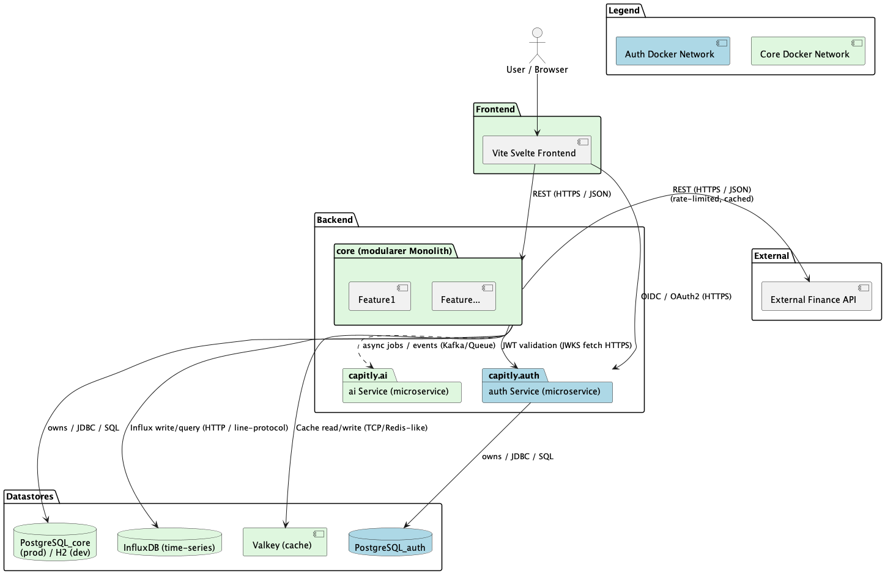

# Gesamtsystem Architektur
Es sei zu beachten, dass dies ein Lernprojekt ist.

Diese Datei ergänzt das Architekturdiagramm um Entscheidungshintergründe, Verantwortlichkeiten der Komponenten und Überlegungen.

## Kurzüberblick
- Architektur‑Typ: Modularer Monolith (`core`) kombiniert mit gezielten Microservices (`auth`, `ai`) und einem containerisierten Frontend.
- Warum: Der modulare Monolith erlaubt schnellere Iterationen zu Beginn im kleinen Team und einfache Integration der Business‑Logik; separate Microservices kapseln sicherheits- und skalenkritische Funktionalität (z. B. Auth), die unabhängig betrieben oder skaliert werden kann.
- Hauptziele:
  - **Sicherheit:** Trennung von Auth‑Domain und sensiblen Credentials in einem eigenen Netzwerk und eigener Datenbank.
  - **Entwickler‑Produktivität:** Schnellere Änderungen im Monolithen ohne den Overhead vieler kleiner Services.
  - **Skalierbarkeit & Zukunftssicherheit:** Erlaubt späteres Aufbrechen von Modulen in Microservices, falls Teile stark skalieren müssen.

## Komponenten (mit Erläuterungen und Entscheidungsunterpunkten)

- **Frontend: Vite / Svelte (SPA)**
	- Zweck: Benutzeroberfläche, Darstellung von Charts/Reports, Interaktion mit API‑Routen.
	- Entscheidung: Vite + Svelte für schnelle Dev-Iteration und kleine Bundle‑Größen, Svelte für angenehmer als Alternativen befunden.

- **Core (capitly‑core) — Spring Boot (Java)**
	- Zweck: Kern‑Businesslogik, Domain‑Modelle, REST API, Aggregation von Daten aus DBs, Caching, Integrationspunkte zu ML und externen APIs.
	- Entscheidungsunterpunkt: Java/Spring gewählt wegen bestehendern Java Kentnissen, stabilem Ökosystem und guter JVM‑Betriebsqualität. Bei starker ML‑Integration kann ein separates Service in Python sinnvoll sein (siehe ML‑Abschnitt).

- **Auth Service (capitly.auth) — Spring Authorization Server (Java)**
	- Zweck: OIDC/OAuth2 Autorisierung, Benutzerverwaltung, Token‑Issuance (JWT, Refresh‑Tokens), sichere Trennung von Auth‑Daten.
	- Entscheidung: Eigenes Microservice, um Schlüsselmaterial, Token‑Lifecycle und Sicherheitsrichtlinien isoliert zu betreiben; ermöglicht unabhängigere Updates und Härtungsmaßnahmen.

- **ML Service (capitly.ai) — Inference / Modell‑Hosting**
	- Zweck: Modelle für Vorhersagen, Scoring, Anomalieerkennung oder Portfolio‑Auswertung bereitstellen, wir schauen mal was wird.
	- Entscheidung (Unterpunkt): Implementierungsoptionen:
		- **Python:** breites Ökosystem (pandas, scikit‑learn, TensorFlow, PyTorch, Prophet), einfacher Zugriff auf Community‑Modelle.
		- **Java (DJL/ONNX):** einfachere Integration in Spring Boot, konsistenter Betrieb auf JVM, geringere Plattformvielfalt.
		- **Entscheidung ausstehend**
			- auch möglich: Python zum Trainieren, Java zum Serven
	- ML‑Ansatz: Hier sind noch viele Entscheidungen offen, zum Beispiel welche Daten ausgewertet werden, welche Modelle sinnvoll sind und ob wir zunächst nur ein kleines Prototyp‑Setup bauen.
	- Offene Fragen:
		- Welche Zielsetzung haben wir konkret: Forecasting, Risikoanalyse, Anomalieerkennung oder ...?
		- Welche Daten liegen wirklich in ausreichender Qualität und Menge vor?
		- Soll das Training getrennt vom Serving laufen?

- **Externe Finance APIs (mehrere Anbieter möglich)**
	- Zweck: Kursdaten, historische Zeitreihen, Referenzdaten.
	- Mögliche Anbieter (Schnittstellen/Preis/Rate limits beachten):
		- Alpha Vantage: https://www.alphavantage.co
		- Financial Modeling Prep (FMP): https://financialmodelingprep.com
		- StockData: https://stockdata.org
		- Massive (Anbieterlink prüfen): https://massive.com
		- Leeway (Anbieterlink prüfen): https://leeway.tech  
	- Entscheidungsunterpunkt: Anbieter nach benötigter Latenz, Kosten, Coverage (Aktien, Krypto), historische Tiefe und API‑Limits auswählen. Es ist sinnvoll, ein Fallback‑/Cache‑Layer zu verwenden, um Rate‑Limit‑Fehler zu vermeiden.
	Es können auch mehere Anbieter kombiniert werden

## Docker‑Netzwerke
- Auth‑Netz (hellblau): enthält `Auth` + `PostgreSQL_auth` — isoliert Credentials und Token‑Lifecycle.
- Core‑Netz (hellgrün): enthält `core`, `AI`, Core‑DB(s), InfluxDB, Valkey — erlaubt interne Kommunikation und Cache‑Zugriff.

## Kommunikation (Pfeile)
- `Frontend -> Core`: REST (HTTPS / JSON) — UI‑Interaktionen, Charts, CRUD
- `Frontend -> auth`: OIDC/OAuth2 (HTTPS) — Login / Token‑Flow (PKCE für SPA)
- `Core -> auth`: JWKS / JWT‑Validierung (HTTPS)
- `Core -> ai`: async jobs (Kafka) oder HTTP Job API — Batch/Inference
- `Core -> External Finance API`: REST (HTTPS / JSON), Websockets — rate‑limited, cached
- `Core -> PostgreSQL_core`: JDBC / SQL; `auth -> PostgreSQL_auth`: JDBC / SQL
- `Core -> Valkey`: Cache read/write (Redis‑like)
- `Core -> InfluxDB`: Time‑Series writes/queries (HTTP / line‑protocol)

## Datenbanken — Zweck / gespeicherte Inhalte

- **PostgreSQL_auth**
	- Speichert: Benutzerkonten, Credentials (gehasht), Rollen, Berechtigungen, Refresh‑Token Hashes, Audit‑Logs (optional).

- **PostgreSQL_core**
	- Speichert: Geschäftsdaten wie registrierte Konten, Transaktionen, Vermögensdaten (Wertpapiere, Krypto‑Positionen), Metadaten zu Nutzern/Portfolios, persistente Einstellungen.

- **InfluxDB**
	- Speichert: Historische Finanzzeitreihen (Preise, Indikatoren, zeitbasierte Metriken) für schnelle Zeitreihenabfragen, Aggregationen und Visualisierungen.

- **Valkey (Cache)**
	- Zweck: Kurzlebige Cache‑Layer für externe Finanzdaten (Quotes, Ticker‑Lookups), API‑Rate‑limit‑Abmilderung und schnelle Antwortzeiten. Optional: Teile des häufig abgefragten `PostgreSQL_core` (Read‑heavy) können im Cache liegen.

- **Retention & Backup**
	- Postgres: tägliche Backups, WAL‑Archivierung für Point‑in‑Time Recovery (mal anschauen); sensible Daten verschlüsselt im Ruhezustand speichern.

- **Cache‑Strategie (Valkey)**
	- TTLs pro Key‑Typ (z. B. Quotes 30s–5min, Reference‑Data 24h).
	- LRU oder LFU Eviction, Namespacing (`quotes:{symbol}`, `positions:{userId}`) und Cache‑Warmup für häufig benutzte Queries.
	- **Entscheidungen folgen zu einem spätern zeitpunkt, wenn der Cache eigebunden wird**

- **Sicherheit & Zugriff**
	- Rollenbasierter DB‑Zugriff: Auth‑DB nur für Auth‑Service, Core‑DB nur für Core und autorisierte Batch‑Jobs.
	- Anwendungsspezifische DB‑Credentials, regelmäßig rotieren, Zugriff über bastion/privates Netzwerk für Produktionsumgebungen.

- **Performance & Skalierung**
	- Read‑Replicas für `PostgreSQL_core` bei hoher Lese-Last (Reports, Dashboards).
	- Zeitreihenkompression / Downsampling in InfluxDB für ältere Daten.

## Sicherheit — Auth / JWT Flow (verbindlich, Spring‑basierter Standard)

Verbindliche Architekturentscheidung: Der `auth` Microservice ist der **Authorization Server** und stellt Access‑ und Refresh‑Tokens aus; das `core` Backend ist der **Resource Server** und prüft diese Tokens, bevor es Geschäftslogik ausführt. Der Authorization Server signiert die Tokens, der Resource Server validiert sie lokal via JWKS und vertraut dabei auf die vom Authorization Server veröffentlichte Signatur. Für die Implementierung verwenden wir standardisiert **Spring Security**.

Ziel: Klare, standardisierte Implementierung für Token‑Issuance, lokale Verifikation und sichere Handhabung von Refresh‑Tokens mit Spring‑Technologien.

1. **Anmeldung (Frontend → Auth Service)**
	- Das SPA startet zwingend den OIDC Authorization Code Flow mit PKCE (kein Implicit Flow, kein direkte Token‑Grant für SPAs).
	- Der Nutzer authentifiziert sich (Passwort, MFA optional). Der `auth` Service (Spring Authorization Server) signiert danach ein Access Token (JWT, RS256) und erstellt ein Refresh Token.

		Was ist der OIDC PKCE‑Flow?

		- PKCE = Proof Key for Code Exchange. Es ist eine Erweiterung des OAuth2 Authorization Code Flows, speziell für öffentliche Clients (z. B. SPAs, Mobile Apps), bei denen ein Client‑Secret nicht sicher gespeichert werden kann.
		- Kurzablauf:
			1. Das SPA erzeugt einen zufälligen `code_verifier` (hohe Entropie) und berechnet daraus den `code_challenge` (meist SHA256 und Base64URL‑encodiert).
			2. Das SPA startet die Authorization Request an den Auth‑Service mit Parametern wie `response_type=code`, `client_id`, `redirect_uri`, `scope`, `code_challenge` und `code_challenge_method=S256`.
			3. Nach erfolgreicher Authentifizierung liefert der Authorization Server einen Authorization Code an die `redirect_uri` des SPAs.
			4. Das SPA tauscht den Authorization Code gegen Tokens am Token Endpoint: es sendet `grant_type=authorization_code`, `code`, `redirect_uri`, `client_id` und den zuvor erzeugten `code_verifier`.
			5. Der Auth‑Service überprüft, ob der `code_verifier` mit dem früher übergebenen `code_challenge` korrespondiert; bei Erfolg werden Access Token (+ ggf. Refresh Token) ausgegeben.

		- Sicherheitsvorteile:
			- Selbst wenn ein Authorization Code abgefangen wird, kann ein Angreifer ohne den `code_verifier` kein Token tauschen.
			- Kein Client‑Secret notwendig für SPAs.

		- Praktische Hinweise für SPAs:
			- Generiere `code_verifier` sicher in Memory; niemals persistieren.
			- Verwende `S256` (SHA256) als `code_challenge_method` (nicht `plain`).
			- Nutze HTTPS und setze passende `state`‑Parameter zur CSRF‑Vermeidung.
			- Nach Token‑Erhalt Access Token kurz leben lassen; Refresh Token sicher (httpOnly Cookie) speichern und Rotation erwägen.

2. **Token‑Übergabe an das Frontend (Standard‑Vorgehen)**
	- Das JWT ist das Access Token: es ist kurzlebig und wird bei API‑Aufrufen an `core` geschickt.
	- Der Refresh Token ist kein JWT für die API, sondern dient nur dazu, später ein neues Access Token zu holen.
	- Für SPAs: Access Token im Memory halten, Refresh Token im Secure httpOnly Cookie speichern.

3. **API‑Aufrufe (Frontend → Core)**
	- Frontend sendet das JWT im `Authorization: Bearer <token>` Header an `core`.

4. **Lokale JWT‑Verifikation im Core (Resource Server)**
	- `core` wird als OAuth2 Resource Server mit Spring Security konfiguriert und prüft die JWTs lokal über den JWKS‑Endpoint des Auth‑Services.

5. **Handling von Revocation / Introspection**
	- Der Refresh Token kann beim Logout oder bei Verdacht widerrufen werden.
	- Das Access Token läuft kurz ab; genau dafür gibt es den Refresh Token.

6. **Refresh Flow**
	- Wenn das JWT abläuft, nutzt das Frontend den Refresh Token, um beim `Auth` Service ein neues JWT zu holen.
	- Der `auth` Service prüft den Refresh Token und gibt ein neues Access Token aus; optional wird der Refresh Token rotiert.

7. **Key‑Rotation & JWKS‑Caching**
	- Der `auth` Service veröffentlicht neue öffentliche Schlüssel über JWKS, `core` cached sie für die lokale Signaturprüfung.

8. **Rollenmodell und Berechtigungen**

- Das konkrete Rollenmodell muss noch entworfen werden; aktuell ist nur die Richtung klar: Rechte werden über Rollen und Scopes im JWT abgebildet.
- Das `core` Backend prüft bei jeder Anfrage, ob die Rolle oder der Scope zum Endpunkt passt. Wenn nicht, wird der Zugriff abgelehnt.
- Der `auth` Service muss diese Rollen/Scopes beim Ausstellen des JWTs mitgeben, damit `core` sie lokal auswerten kann.